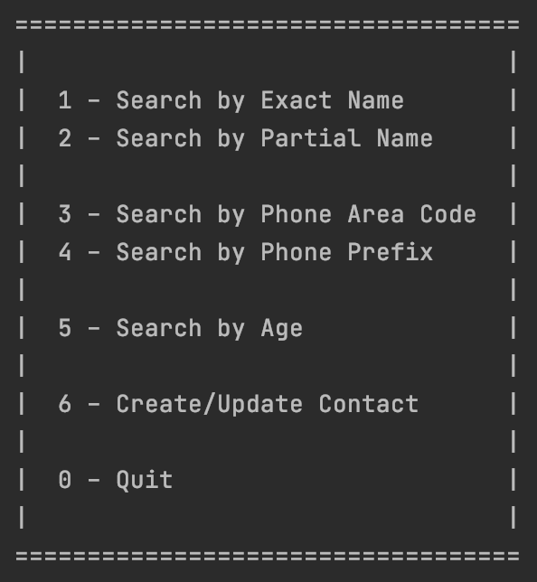

# Database ORM Address Book
A python console application that uses a MySQL database and an ORM to manage a
simple address book.

* [Using the Program](./README.md#using-the-program)
* [Installation](./README.md#installation)
  * [Requirements](./README.md#requirements)
  * [Setup](./README.md#setup)

-----

# Using the Program

Run the program by cloning or downloading this repository, then navigating to
the directory where the file resides.

Follow the [installation requirements](./README.md#installation) at the bottom
of this document for any required software or drivers.

Then, execute the program:

```python
./main.py
```

You will be presented with a menu that you can use to select your options for
interacting with the address book.



Type your menu choice and follow the steps to interact with the program.

-----

# Installation & Setup

## Requirements

It is recommended that you use [PyCharm](https://www.jetbrains.com/pycharm/download/)
as your IDE for this project. This allows you to easily create a virtual environment
for loading dependencies.

* [Install MySQL](https://dev.mysql.com/downloads/mysql/)
* [SQL Alchemy](https://www.sqlalchemy.org/download.html#current)
* [Install PyMySQL](https://pymysql.readthedocs.io/en/latest/user/installation.html)
  * Include the dependency for “sha256_password” authentication.

## Setup

Run the seed file to set up your database in MySQL.

* [`MySQL/create.sql`](./MySQL/create.sql)
  * All that this seed file does is create the schema, `AddressBookORM`.
* [`setup.py`](./setup.py)
  * This builds and populates our tables
