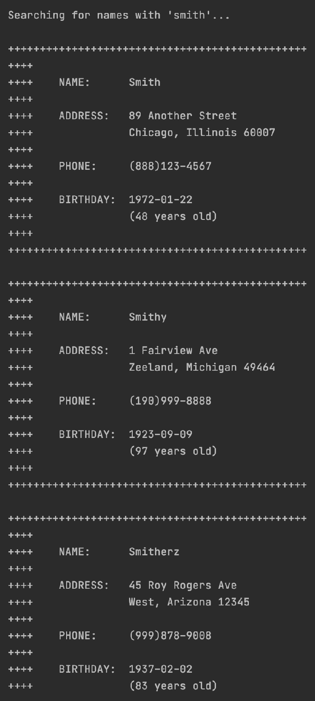

# Database ORM Address Book
A python console application that uses a MySQL database and an ORM to manage a
simple address book using ORM.

_To see the same application but set up using connectors, please see https://github.com/amajor/DatabaseAddressBook_

* [Using the Program](./README.md#using-the-program)
  * [Search by Name](./README.md#search-by-name)
  * [Search by Phone Number](./README.md#search-by-phone-number)
  * [Search by Age Range](./README.md#search-by-age-range)
  * [Add or Update Person](./README.md#add-or-update-person)
* [Installation](./README.md#installation)
  * [Requirements](./README.md#requirements)
  * [Setup](./README.md#setup)

-----

# Using the Program

Run the program by cloning or downloading this repository, then navigating to
the directory where the file resides.

Follow the [installation requirements](./README.md#installation) at the bottom
of this document for any required software or drivers.

Then, execute the program:

```python
./main.py
```

You will be presented with a menu that you can use to select your options for
interacting with the address book.


Type your menu choice and follow the steps to interact with the program.

## Search by Name

If a result is not found, the application will alert you.


Additionally, the search is not case-sensitive.


If you choose to search by partial name, you can enter any part of the name
and see any matching results.

If multiple records match your search criteria, you will see all results
printed to the console.



## Search by Phone Number

The phone format is given to you for an idea of what you use in your search.


Search by the Area Code.


Or search by the phone prefix number.


## Search by Age Range

Provide a minimum and maximum age to get back all contacts in that range.


## Add or Update Person

When you choose to create or update a contact, the system will check to see if
a person by that name already exists.

If not, a new person will be created and then displayed.


If the person does exist, the address store will be updated to end the range of
living at the previous addres, will add a new address, and will then link the
user to the new address. The phone number will also be updated.


You can also see from the joined tables below that we've stored past addresses, but added a new association for the
current address with a `start_date` set to today's date.


_Note: The birthday will be ignored on updates._

-----

# Installation & Setup

## Requirements

It is recommended that you use [PyCharm](https://www.jetbrains.com/pycharm/download/)
as your IDE for this project. This allows you to easily create a virtual environment
for loading dependencies.

* [Install MySQL](https://dev.mysql.com/downloads/mysql/)
* [SQL Alchemy](https://www.sqlalchemy.org/download.html#current)
* [Install PyMySQL](https://pymysql.readthedocs.io/en/latest/user/installation.html)
  * Include the dependency for “sha256_password” authentication.

## Setup

Run the seed file to set up your database in MySQL.

* [`MySQL/create.sql`](./MySQL/create.sql)
  * All that this seed file does is create the schema, `AddressBookORM`.
* [`setup.py`](./setup.py)
  * This builds and populates our tables

## Packages

These are the packages that were available during my development in PyCharm if you find yourself needing a reference:


